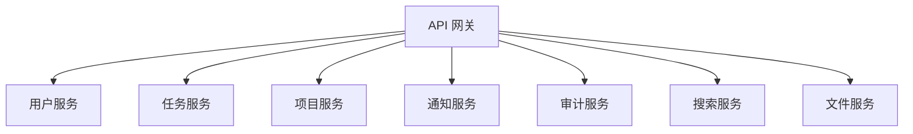

# 示例：Spring Boot 应用架构设计

这个示例展示 architect 代理如何为 Spring Boot 应用设计高可用架构。

## 业务需求

设计一个企业级任务管理系统，支持：
- 10,000+ 并发用户
- 99.9% 可用性
- 全球多区域部署
- 实时协作功能
- 完整的审计和日志

## 架构设计

```
                          [用户]
                            |
                            v
+---------------------[CDN]---------------------+
|                   CloudFlare                  |
|              静态资源 + DDoS 防护             |
+---------------------|-------------------------+
                      |
                      v
            +-------------------+
            |   负载均衡器       |
            |   AWS ALB / WAF   |
            +--------|----------+
                     |
                     v
       +-------------------------------+
       |          API 网关              |
       |    (Spring Cloud Gateway)      |
       |  - 认证授权                     |
       |  - 限流熔断                     |
       |  - 路由分发                     |
       |  - API 版本管理                 |
       +--------|----------|-------------+
                |          |
      +---------+          +---------+
      |                            |
      v                            v
+-----------+              +-----------+
| 微服务集群  |              | 微服务集群  |
+-----------+              +-----------+
|           |              |           |
+-----------+              +-----------+
|           |              |           |
v           v              v           v
+-------+ +-------+ +-------+ +-------+
| 用户   | | 任务   | | 通知   | | 审计   |
| 服务   | | 服务   | | 服务   | | 服务   |
+-------+ +-------+ +-------+ +-------+
    |         |         |         |
    |         |         v         v
    |         |   [Kafka 集群] [Elasticsearch]
    |         |         |         |
    v         v         v         v
+-------+ +-------+ +-------+ +-------+
| MySQL | | Redis | | Redis | | S3    |
| 集群   | | 集群   | | 集群   | | 存储  |
+-------+ +-------+ +-------+ +-------+
```

## 技术栈

### 后端服务

| 组件 | 技术 | 版本 |
|------|------|------|
| **框架** | Spring Boot | 3.2.x |
| **语言** | Java / Kotlin | 17 / 1.9 |
| **API 网关** | Spring Cloud Gateway | 4.1.x |
| **服务发现** | Spring Cloud Consul | 3.2.x |
| **配置管理** | Spring Cloud Config | 4.1.x |
| **消息队列** | Apache Kafka | 3.6.x |
| **缓存** | Redis Cluster | 7.x |
| **数据库** | MySQL | 8.x |
| **搜索引擎** | Elasticsearch | 8.x |
| **对象存储** | AWS S3 | - |
| **监控** | Prometheus + Grafana | - |
| **日志** | ELK Stack | - |

### 前端应用

| 组件 | 技术 | 版本 |
|------|------|------|
| **框架** | Next.js | 14.x |
| **语言** | TypeScript | 5.x |
| **状态管理** | Zustand / Redux | - |
| **实时通信** | Socket.IO | 4.x |
| **UI 库** | Tailwind CSS | 3.x |

## 微服务架构

### 服务拆分



#### 1. 用户服务 (User Service)

**职责**:
- 用户认证和授权
- 用户信息管理
- 权限管理
- 用户设置

**技术栈**:
- Spring Security
- JWT
- OAuth 2.0
- BCrypt 密码加密

**数据库**:
```sql
CREATE TABLE users (
    id BIGINT PRIMARY KEY AUTO_INCREMENT,
    username VARCHAR(50) NOT NULL UNIQUE,
    email VARCHAR(100) NOT NULL UNIQUE,
    password_hash VARCHAR(255) NOT NULL,
    full_name VARCHAR(100),
    avatar_url VARCHAR(255),
    status VARCHAR(20) NOT NULL DEFAULT 'ACTIVE',
    created_at TIMESTAMP NOT NULL DEFAULT CURRENT_TIMESTAMP,
    updated_at TIMESTAMP NOT NULL DEFAULT CURRENT_TIMESTAMP ON UPDATE CURRENT_TIMESTAMP,
    INDEX idx_username (username),
    INDEX idx_email (email),
    INDEX idx_status (status)
) ENGINE=InnoDB DEFAULT CHARSET=utf8mb4;

CREATE TABLE roles (
    id BIGINT PRIMARY KEY AUTO_INCREMENT,
    name VARCHAR(50) NOT NULL UNIQUE,
    description VARCHAR(200),
    created_at TIMESTAMP NOT NULL DEFAULT CURRENT_TIMESTAMP
) ENGINE=InnoDB DEFAULT CHARSET=utf8mb4;

CREATE TABLE user_roles (
    user_id BIGINT NOT NULL,
    role_id BIGINT NOT NULL,
    PRIMARY KEY (user_id, role_id),
    FOREIGN KEY (user_id) REFERENCES users(id) ON DELETE CASCADE,
    FOREIGN KEY (role_id) REFERENCES roles(id) ON DELETE CASCADE
) ENGINE=InnoDB DEFAULT CHARSET=utf8mb4;
```

**API 端点**:
```
POST   /api/auth/register
POST   /api/auth/login
POST   /api/auth/logout
POST   /api/auth/refresh-token
GET    /api/users/me
PUT    /api/users/me
GET    /api/users/{id}
GET    /api/users?page=1&size=20
DELETE /api/users/{id}
POST   /api/users/{id}/roles
DELETE /api/users/{id}/roles/{roleId}
```

---

#### 2. 任务服务 (Task Service)

**职责**:
- 任务 CRUD 操作
- 任务分配
- 任务状态管理
- 任务优先级管理
- 任务搜索和筛选

**技术栈**:
- Spring Data JPA
- Spring Cache
- Kafka（事件发布）

**数据库**:
```sql
CREATE TABLE tasks (
    id BIGINT PRIMARY KEY AUTO_INCREMENT,
    project_id BIGINT NOT NULL,
    title VARCHAR(200) NOT NULL,
    description TEXT,
    status VARCHAR(20) NOT NULL DEFAULT 'TODO',
    priority VARCHAR(10) NOT NULL DEFAULT 'MEDIUM',
    assignee_id BIGINT,
    creator_id BIGINT NOT NULL,
    due_date TIMESTAMP NULL,
    created_at TIMESTAMP NOT NULL DEFAULT CURRENT_TIMESTAMP,
    updated_at TIMESTAMP NOT NULL DEFAULT CURRENT_TIMESTAMP ON UPDATE CURRENT_TIMESTAMP,
    FOREIGN KEY (project_id) REFERENCES projects(id) ON DELETE CASCADE,
    FOREIGN KEY (assignee_id) REFERENCES users(id) ON DELETE SET NULL,
    FOREIGN KEY (creator_id) REFERENCES users(id) ON DELETE CASCADE,
    INDEX idx_project_id (project_id),
    INDEX idx_assignee_id (assignee_id),
    INDEX idx_status (status),
    INDEX idx_priority (priority),
    INDEX idx_due_date (due_date)
) ENGINE=InnoDB DEFAULT CHARSET=utf8mb4;
```

**API 端点**:
```
POST   /api/tasks
GET    /api/tasks
GET    /api/tasks/{id}
PUT    /api/tasks/{id}
DELETE /api/tasks/{id}
GET    /api/tasks?projectId={id}
GET    /api/tasks?assigneeId={id}
GET    /api/tasks?status={status}
GET    /api/tasks/search?q={query}
POST   /api/tasks/{id}/assign
POST   /api/tasks/{id}/status
POST   /api/tasks/{id}/comments
```

---

#### 3. 项目服务 (Project Service)

**职责**:
- 项目 CRUD 操作
- 项目成员管理
- 项目权限管理
- 项目统计

**API 端点**:
```
POST   /api/projects
GET    /api/projects
GET    /api/projects/{id}
PUT    /api/projects/{id}
DELETE /api/projects/{id}
POST   /api/projects/{id}/members
DELETE /api/projects/{id}/members/{userId}
GET    /api/projects/{id}/stats
```

---

#### 4. 通知服务 (Notification Service)

**职责**:
- 发送邮件通知
- 发送短信通知
- 推送通知
- 实时通知（WebSocket）

**技术栈**:
- Spring WebSocket
- Kafka（事件订阅）
- SendGrid（邮件）
- Twilio（短信）

**消息格式**:
```json
{
  "type": "TASK_ASSIGNED",
  "userId": "123",
  "taskId": "456",
  "message": "你被分配了一个新任务：实现用户认证",
  "channels": ["EMAIL", "PUSH", "SMS"]
}
```

---

#### 5. 审计服务 (Audit Service)

**职责**:
- 记录所有操作
- 存储审计日志
- 审计日志查询
- 合规性报告

**技术栈**:
- Elasticsearch
- Kafka（事件订阅）

---

#### 6. 搜索服务 (Search Service)

**职责**:
- 全文搜索
- 搜索建议
- 搜索统计

**技术栈**:
- Elasticsearch
- Spring Data Elasticsearch

---

#### 7. 文件服务 (File Service)

**职责**:
- 文件上传
- 文件下载
- 文件管理
- 图片处理

**技术栈**:
- AWS S3
- ImageMagick

## 可用性设计

### 冗余设计

| 组件 | 冗余策略 | 故障转移 |
|------|----------|----------|
| API 网关 | 多实例 + 健康检查 | 自动故障转移 |
| 微服务 | 多实例 + 健康检查 | 自动故障转移 |
| MySQL | 主从复制 | 自动切换到从库 |
| Redis | 集群模式 | 自动故障转移 |
| Kafka | 集群模式 | 自动故障转移 |

### 故障恢复

```java
// 熔断器配置
@CircuitBreaker(name = "userService", fallbackMethod = "getUserFallback")
public User getUser(Long userId) {
    return userClient.getUser(userId);
}

public User getUserFallback(Long userId, Exception e) {
    // 从缓存获取或返回默认值
    return cacheManager.getCache("users").get(userId, User.class);
}

// 重试配置
@Retry(name = "taskService", maxAttempts = 3, fallbackMethod = "saveTaskFallback")
public Task saveTask(Task task) {
    return taskRepository.save(task);
}

public Task saveTaskFallback(Task task, Exception e) {
    // 重试失败，记录日志并抛出业务异常
    log.error("Failed to save task after 3 attempts", e);
    throw new TaskSaveException("Failed to save task", e);
}
```

## 性能优化

### 缓存策略

```java
@Service
public class TaskService {

    @Cacheable(value = "tasks", key = "#id", unless = "#result == null")
    public Task findById(Long id) {
        return taskRepository.findById(id).orElse(null);
    }

    @CachePut(value = "tasks", key = "#task.id")
    public Task save(Task task) {
        return taskRepository.save(task);
    }

    @CacheEvict(value = "tasks", key = "#id")
    public void deleteById(Long id) {
        taskRepository.deleteById(id);
    }

    @Caching(evict = {
        @CacheEvict(value = "tasks", key = "#task.id"),
        @CacheEvict(value = "projectTasks", allEntries = true)
    })
    public Task updateTask(Task task) {
        return taskRepository.save(task);
    }
}
```

### 数据库优化

```sql
-- 添加合适的索引
CREATE INDEX idx_tasks_project_status ON tasks(project_id, status);
CREATE INDEX idx_tasks_assignee_due ON tasks(assignee_id, due_date);

-- 使用分区表（按时间分区）
CREATE TABLE tasks (
    ...
) PARTITION BY RANGE (YEAR(created_at)) (
    PARTITION p2023 VALUES LESS THAN (2024),
    PARTITION p2024 VALUES LESS THAN (2025),
    PARTITION p2025 VALUES LESS THAN (2026)
);

-- 读写分离
-- 主库处理写操作
-- 从库处理读操作
```

## 安全设计

### 认证授权

```java
@Configuration
@EnableWebSecurity
public class SecurityConfig {

    @Bean
    public SecurityFilterChain filterChain(HttpSecurity http) throws Exception {
        return http
            .csrf(csrf -> csrf.disable())
            .sessionManagement(sm -> sm
                .sessionCreationPolicy(SessionCreationPolicy.STATELESS))
            .authorizeHttpRequests(auth -> auth
                .requestMatchers("/api/auth/**").permitAll()
                .requestMatchers("/api/public/**").permitAll()
                .anyRequest().authenticated())
            .addFilterBefore(jwtAuthenticationFilter(),
                UsernamePasswordAuthenticationFilter.class)
            .build();
    }

    @Bean
    public PasswordEncoder passwordEncoder() {
        return new BCryptPasswordEncoder();
    }
}

// RBAC 权限检查
@PreAuthorize("hasRole('ADMIN')")
@DeleteMapping("/api/users/{id}")
public void deleteUser(@PathVariable Long id) {
    userService.deleteById(id);
}

@PreAuthorize("@userService.isCurrentUser(#id) or hasRole('ADMIN')")
@PutMapping("/api/users/{id}")
public User updateUser(@PathVariable Long id, @RequestBody UserUpdateRequest request) {
    return userService.updateUser(id, request);
}
```

### 数据安全

```java
// 敏感数据加密
@Entity
public class User {
    @Id
    private Long id;

    @Column(nullable = false, unique = true)
    private String email;

    @Column(nullable = false)
    @Convert(converter = PasswordHashConverter.class)
    private String passwordHash;

    @Column(name = "credit_card")
    @Convert(converter = EncryptedStringConverter.class)
    private String creditCard;
}

// 数据脱敏
@Data
public class UserResponse {
    private Long id;
    private String email;
    private String fullName;

    @JsonIgnore
    private String passwordHash;  // 不包含在 JSON 响应中

    @JsonProperty("phone")
    public String getPhone() {
        // 脱敏处理
        if (phone == null) return null;
        return phone.replaceAll("(\\d{3})\\d{4}(\\d{4})", "$1****$2");
    }
}
```

## 部署架构

### Kubernetes 配置

```yaml
# deployment.yaml
apiVersion: apps/v1
kind: Deployment
metadata:
  name: user-service
spec:
  replicas: 3
  selector:
    matchLabels:
      app: user-service
  template:
    metadata:
      labels:
        app: user-service
    spec:
      containers:
      - name: user-service
        image: myregistry/user-service:1.0.0
        ports:
        - containerPort: 8080
        env:
        - name: SPRING_PROFILES_ACTIVE
          value: "prod"
        - name: DB_HOST
          valueFrom:
            secretKeyRef:
              name: db-secret
              key: host
        - name: DB_PASSWORD
          valueFrom:
            secretKeyRef:
              name: db-secret
              key: password
        livenessProbe:
          httpGet:
            path: /actuator/health
            port: 8080
          initialDelaySeconds: 60
          periodSeconds: 30
        readinessProbe:
          httpGet:
            path: /actuator/health/readiness
            port: 8080
          initialDelaySeconds: 30
          periodSeconds: 10
        resources:
          requests:
            memory: "512Mi"
            cpu: "500m"
          limits:
            memory: "1Gi"
            cpu: "1000m"
---
apiVersion: v1
kind: Service
metadata:
  name: user-service
spec:
  selector:
    app: user-service
  ports:
  - protocol: TCP
    port: 80
    targetPort: 8080
  type: ClusterIP
```

### 多区域部署

```
美国区域 (us-east-1)            欧洲区域 (eu-west-1)
     |                                |
[负载均衡器]                    [负载均衡器]
     |                                |
[微服务集群]                    [微服务集群]
     |                                |
[数据库集群]                    [数据库只读副本]
     |                                |
     +-----------+--------------------+
                 |
           [数据同步]
            (异步复制）
```

## 监控和日志

### Prometheus 配置

```yaml
# prometheus.yml
global:
  scrape_interval: 15s

scrape_configs:
  - job_name: 'spring-boot'
    metrics_path: '/actuator/prometheus'
    static_configs:
      - targets: ['user-service:8080', 'task-service:8080']
```

### Grafana Dashboard

监控指标：
- 请求速率（RPS）
- 响应时间（P50, P95, P99）
- 错误率
- JVM 内存使用
- GC 时间
- 线程池状态
- 数据库连接池状态
- 缓存命中率

## 成本估算

### 月度成本（AWS）

| 组件 | 配置 | 数量 | 单价 | 月成本 |
|------|------|------|------|--------|
| EC2 | t3.xlarge (4 vCPU, 16GB) | 15 | $0.166/hour | $1,800 |
| RDS | db.r6g.xlarge (4 vCPU, 32GB) | 3 | $0.98/hour | $2,125 |
| ElastiCache | cache.r6g.large (2 vCPU, 13GB) | 2 | $0.32/hour | $463 |
| ALB | Application Load Balancer | 1 | $0.025/hour + $0.008/LCU | $100 |
| S3 | Standard Storage | 1TB | $0.023/GB | $23 |
| CloudFront | CDN | - | $0.02/GB + $0.0075/10K请求 | $50 |
| EKS | Kubernetes Cluster | 1 | $0.10/hour | $73 |

**总计**: ~$4,634/月

## 风险和缓解

### 技术风险

| 风险 | 影响 | 概率 | 缓解措施 |
|------|------|------|----------|
| 数据库连接池耗尽 | 高 | 中 | 连接池监控，自动扩容 |
| Redis 故障 | 中 | 低 | Redis 集群，降级策略 |
| Kafka 消息堆积 | 中 | 中 | 消费者组扩容，死信队列 |
| API 限流 | 低 | 低 | 令牌桶算法，优雅降级 |

### 运维风险

| 风险 | 影响 | 概率 | 缓解措施 |
|------|------|------|----------|
| 部署失败 | 中 | 低 | 蓝绿部署，回滚机制 |
| 配置错误 | 高 | 低 | 配置版本控制，验证检查 |
| 监控失效 | 中 | 低 | 多级监控，告警机制 |

## 下一步

1. **详细设计**: 每个服务的详细 API 设计
2. **数据库设计**: 完整的数据库模式设计
3. **开发计划**: 分阶段开发计划
4. **测试策略**: 单元测试、集成测试、E2E 测试策略
5. **CI/CD 流水线**: GitLab CI 或 GitHub Actions 配置
